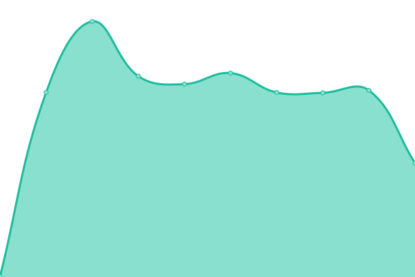
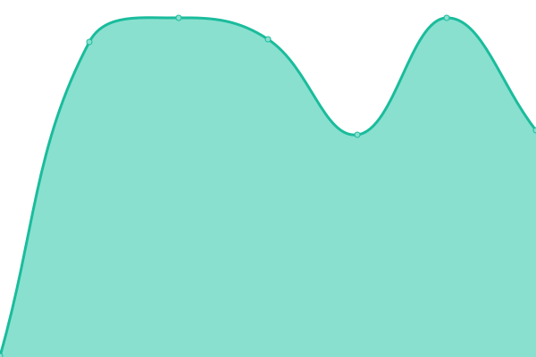
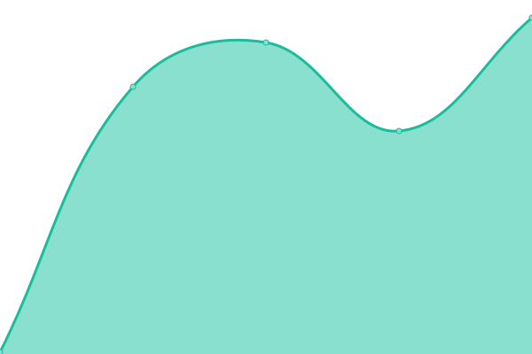

# [📈 Live Status](https://status.craftlime.net): <!--live status--> **🟥 Complete outage**

This repository contains the open-source uptime monitor and status page for [Lime Network](https://craftlime.net), powered by [Upptime](https://github.com/upptime/upptime).

With [Upptime](https://upptime.js.org), you can get your own unlimited and free uptime monitor and status page, powered entirely by a GitHub repository. We use [Issues](https://github.com/limenetwork/limestatus/issues) as incident reports, [Actions](https://github.com/limenetwork/limestatus/actions) as uptime monitors, and [Pages](https://status.craftlime.net) for the status page.

<!--start: status pages-->
<!-- This summary is generated by Upptime (https://github.com/upptime/upptime) -->
<!-- Do not edit this manually, your changes will be overwritten -->
<!-- prettier-ignore -->
| URL | Status | History | Yanıt Süresi | Tüm Zamanların Çalışma Süresi |
| --- | ------ | ------- | ------------- | ------ |
|  Ana Girisler (Java) | Deaktif | [ana-girisler-java.yml](https://github.com/LimeNetwork/limestatus/commits/HEAD/history/ana-girisler-java.yml) | 

 472ms
     
 | 

<a href="https://status.craftlime.net/history/ana-girisler-java">73.35%</a>
    

|  Ana Girisler (Bedrock) | Deaktif | [ana-girisler-bedrock.yml](https://github.com/LimeNetwork/limestatus/commits/HEAD/history/ana-girisler-bedrock.yml) | 

 0ms
     
 | 

<a href="https://status.craftlime.net/history/ana-girisler-bedrock">0.00%</a>
    

|  Towny 1 | Deaktif | [towny-1.yml](https://github.com/LimeNetwork/limestatus/commits/HEAD/history/towny-1.yml) | 

 0ms
     
 | 

<a href="https://status.craftlime.net/history/towny-1">0.00%</a>
    

|  Towny 2 | Deaktif | [towny-2.yml](https://github.com/LimeNetwork/limestatus/commits/HEAD/history/towny-2.yml) | 

 0ms
     
 | 

<a href="https://status.craftlime.net/history/towny-2">0.00%</a>
    

|  Towny 3 | Deaktif | [towny-3.yml](https://github.com/LimeNetwork/limestatus/commits/HEAD/history/towny-3.yml) | 

 0ms
     
 | 

<a href="https://status.craftlime.net/history/towny-3">100.00%</a>
    

|  Towny 4 | Deaktif | [towny-4.yml](https://github.com/LimeNetwork/limestatus/commits/HEAD/history/towny-4.yml) | 

 0ms
     
 | 

<a href="https://status.craftlime.net/history/towny-4">100.00%</a>
    

|  SkyBlock | Deaktif | [sky-block.yml](https://github.com/LimeNetwork/limestatus/commits/HEAD/history/sky-block.yml) | 

 0ms
     
 | 

<a href="https://status.craftlime.net/history/sky-block">100.00%</a>
    

|  Creative | Deaktif | [creative.yml](https://github.com/LimeNetwork/limestatus/commits/HEAD/history/creative.yml) | 

 0ms
     
 | 

<a href="https://status.craftlime.net/history/creative">0.00%</a>
    

|  Lobi | Deaktif | [lobi.yml](https://github.com/LimeNetwork/limestatus/commits/HEAD/history/lobi.yml) | 

 0ms
     
 | 

<a href="https://status.craftlime.net/history/lobi">100.00%</a>
    

|  Çakma Lobi | Deaktif | [cakma-lobi.yml](https://github.com/LimeNetwork/limestatus/commits/HEAD/history/cakma-lobi.yml) | 

 0ms
     
 | 

<a href="https://status.craftlime.net/history/cakma-lobi">100.00%</a>
    

|  Survival (SMP) | Deaktif | [survival-smp.yml](https://github.com/LimeNetwork/limestatus/commits/HEAD/history/survival-smp.yml) | 

 0ms
     
 | 

<a href="https://status.craftlime.net/history/survival-smp">100.00%</a>
    

<!--end: status pages-->

[**Visit our status website →**](https://status.craftlime.net)

## 📄 License

- Powered by: [Upptime](https://github.com/upptime/upptime)
- Code: [MIT](./LICENSE) © [Lime Network](https://craftlime.net)
- Data in the `./history` directory: [Open Database License](https://opendatacommons.org/licenses/odbl/1-0/)
